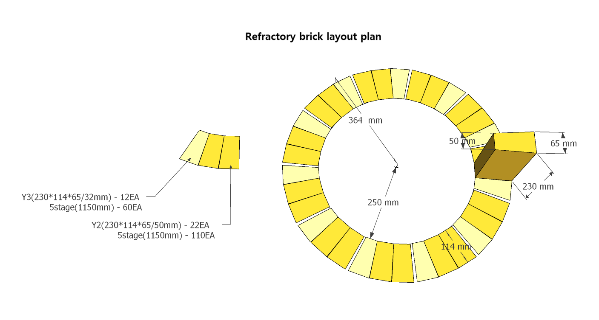
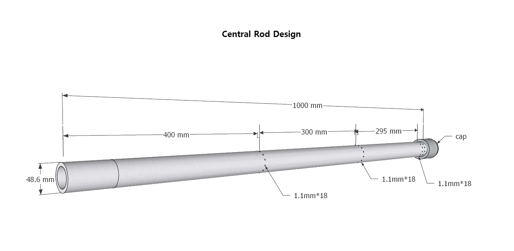
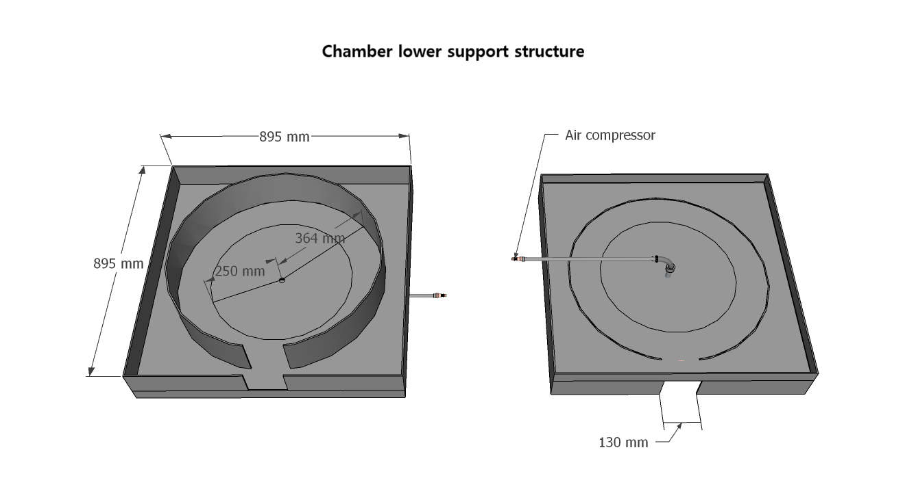

# Chamber Build

## 500mm inner diameter refractory brick structure chamber

### Required amount of refractory bricks

- Quantity of refractory bricks: Total 170EA(Y2-230*114*65/50mmc-> 110EA, Y3-230*114*65/32mm -> 60EA)
- Refractory bricks needed for each level: 34EA(Y2-22EA, Y3-12EA)
- The height of the chamber: 1150mm(230*5) / Outer diameter of the chamber: 728mm

 
  
---

### Central Rod(Pipe)- Choose a type that is easily available nearby.

- Type: Galvanized carbon steel pipe for piping (KSD 3507) - Inner diameter 48mm
- Length: 1000mm
- Number of air nozzles per stage: 16 + (3 columns from the bottom: 2-row layout)
- Air nozzle hole size: 1.1mm
- Position from the bottom of each layer: 400mm(1), 700mm(2), 930mm(3-1), 950mm(3-2)

  

---

### Chamber lower support structure

- It is recommended to use a thick steel plate for the lower support plate of the chamber whenever possible (use 6mm steel plate).

 

### Overview
Short introduction or context.

- Key point 1  
- Key point 2  
- Key point 3  

---

### System Context
Describe where this fits in the AFC-500 framework.

---

### Key Observations
- Observation 1  
- Observation 2  
- Observation 3  

---

### Data / Conditions
| Item | Value |
|------|------|
| Date | YYYY-MM-DD |
| Location | |
| Feedstock | |
| Operation Time | |
| Notes | |

---

### Images

---

### Notes
Additional remarks, anomalies, or field insights.

---

### Conclusion
Short closing statement.

---

### Tags
`AFC-500` `SPCW` `Gas-phase oxidation`
