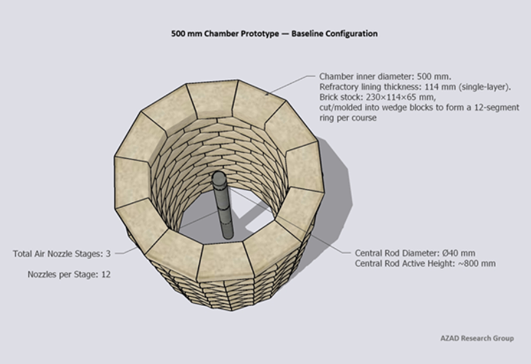

# Tech Note(01): 500 mm Chamber Prototype — Baseline Configuration

This document defines the **initial 500 mm prototype configuration.**
The purpose is to establish a clear geometric and operational baseline from which iterative adjustments and field validation will be performed.

This is a **starting reference**, not a finalized design.

## 1. General Geometry

- **Inner chamber diameter:** 500 mm
- **Refractory lining thickness:** 114 mm (single-layer)
- **Chamber height:** approx. 910 mm
- **Course height:** 65 mm
- **Structure:** 12-segment circular layout formed by wedge-shaped refractory blocks

Each course consists of **12 refractory units**, creating a near-circular internal profile while maintaining simple modular construction.

## 2. Central Rod

- **Configuration:** vertical, centered
- **Approximate active height:** ~800 mm
- Material specification will be defined in later revisions.

The rod is intended to stabilize the core reaction zone without obstructing radial airflow.

## 3. Air Nozzle Arrangement
### Stage Configuration

- 3 air stages
- 12 nozzles per stage (30° spacing)
- Total nozzles: 36

### Vertical Positions (from chamber base)

- Stage 1: 260 mm
- Stage 2: 520 mm
- Stage 3: 780 mm

The lower section beneath Stage 1 is reserved as a loading and accumulation zone to reduce blockage risk.

## 4. Nozzle Orientation — Baseline Philosophy

The prototype begins with the simplest and most reproducible configuration:

- **All nozzles installed horizontally (0°)**
- **Pure radial injection toward the center**

Validation testing will include controlled angle adjustments:

- Upward tilt: +5°
- Downward tilt: −5°

Additional configurations, including dual-row nozzle arrangements per stage, may be evaluated in later engineering revisions.

## 5. Design Intent

This prototype establishes a clear mechanical and geometric starting point.

Key principles:

- Maintain structural simplicity
- Enable direct fabrication and modification
- Allow progressive tuning through field observation rather than theoretical over-optimization

All dimensions are defined in millimeters to support direct workshop implementation.

## 6. Revision Approach

This 500 mm configuration represents:

**“Start here — observe, adjust, and evolve.”**

Future updates may include:

- Material refinements
- Nozzle geometry changes
- Alternative airflow strategies
- Structural reinforcement options

  <figure style="text-align:center; margin:0;">
  
       <alt="image of 500mm">
       <style="width:30%; max-width:400px;">
  <figcaption style="margin-top:0.4rem; font-size:0.9rem; color:#9ca3af;">Figure. Image of 500mm Chamber Prototype — Baseline Configuration
  </figcaption>
</figure>
