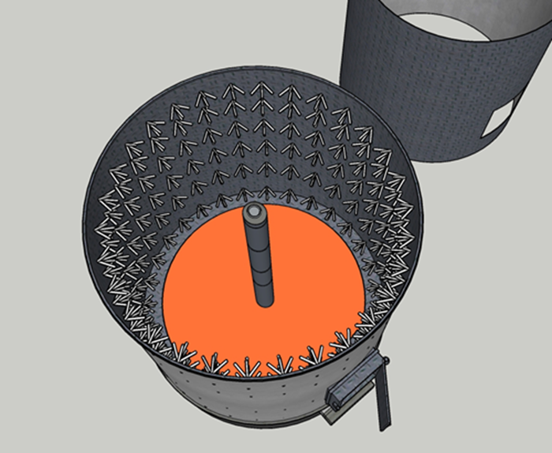

# Field test results-03: Chamber making!

Refractory cement is a hydraulic, heat-resistant building material made primarily of alumina and limestone 
that can withstand high temperatures (1,000°C to 1,800°C or higher). It is used for the installation and maintenance of 
high-temperature furnace linings in furnaces, kilns, stoves, and chimneys.

It is available in two forms: refractory mortar (refractory cement) for bonding refractory bricks and castable for direct pouring.
This section introduces a chamber made of castable for direct pouring.

## Eagle claws

The circular chamber made of direct pour castable material must first be welded with what we commonly call 'eagle claws' 
inside the metal cylinder that forms the chamber exterior.These eagle claws firmly hold the castable material to the circular chamber,
allowing the chamber to withstand high temperature environments.

<figure style="text-align:center; margin:0;">
  
       <alt="image of claws">
       <style="width:50%; max-width:400px; display:block;">
  <figcaption style="margin-top:0.4rem; font-size:0.9rem; color:#9ca3af;">Figure. Image of claws welded inside the chamber
  </figcaption>
</figure>
